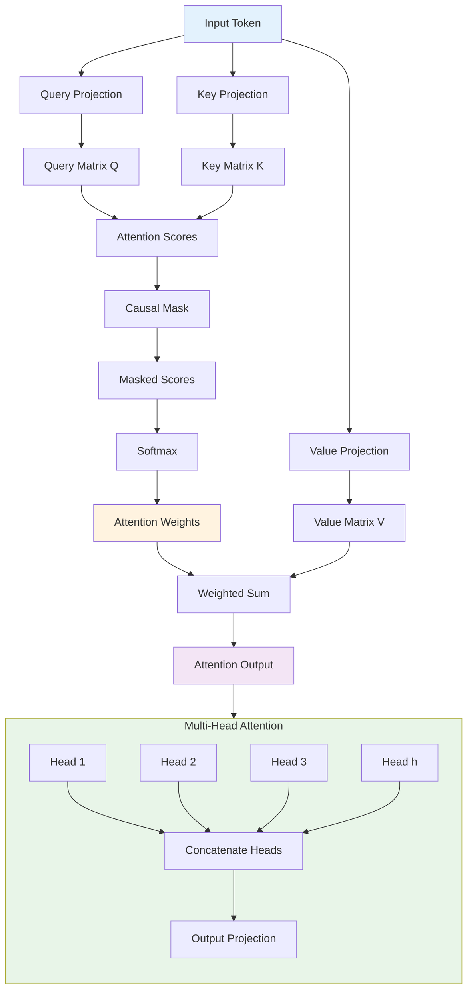

# 🚀 Building Transformers from Scratch: A Complete Deep Dive

## 📋 What You'll Master in This Journey

### 🧠 **Part 1: Transformer Architecture Fundamentals**
- **1.1** What Exactly is a Transformer?
- **1.2** 🔢 Embeddings: Converting Text to Numbers
- **1.3** 🎯 Self-Attention: The Heart of Transformers
- **1.4** 🔄 Multi-Head Attention: Multiple Perspectives
- **1.5** 🔗 Layer Normalization & Residual Connections
- **1.6** 🧠 Feed Forward Network (MLP)

### 📚 **Part 2: Hands-On Implementation**
- Character-Level Transformer Implementation
- Complete Shakespeare Dataset Training
- Text Generation & Sampling Strategies

### 🔗 **Part 3: Professional Resources**
- Key Implementation Details
- Performance Optimization Tips
- References & Further Reading

---

## 🌟 Why This Matters

Large Language Models (LLMs) have revolutionized AI, powering everything from ChatGPT to code generation tools. At the heart of these models lies the **Transformer architecture** - a neural network design that has become the foundation of modern NLP.

**Here's what makes this post special:**
- Zero to hero understanding of Transformers
- Mathematical intuition behind every component  
- Complete working implementation you can run today
- Real insights from building these systems

By the end, you'll have a deep understanding of how Transformers work and hands-on experience building them.

---

## 🏗️ Transformer Architecture Overview



---

Looks overwhelming, right? 😅

**The majority of it is just Matrix Multiplication and the basic chain rule of derivatives! 🙂**

Let's deep dive into each component and understand the mathematical intuition behind it.

# 🧠 Part 1: Understanding Transformer Architecture

## 1.1: What Exactly is a Transformer?

A **Transformer** is a neural network architecture designed to process sequences of data (like text) by understanding relationships between different parts of the sequence. Think of it as a sophisticated pattern recognition system that can:

- Extract meaningful context from text
- Understand relationships between words
- Generate new text based on learned patterns

**Hang in there!** We will see how transformers do all of this with in-depth intuition.

Generally, these LLM models are trained on huge datasets. For example, **GPT-3's training data distribution** looks something like this:

| Dataset | Size | Weight |
|---------|------|--------|
| **Common Crawl (filtered)** | ~570GB | 60% |
| **WebText2** | ~19GB | 22% |
| **Books1** | ~12GB | 8% |
| **Books2** | ~55GB | 8% |
| **Wikipedia** | ~3GB | 3% |
| **Total** | **~659GB** | **100%** |

For our simple transformer, we'll use the tiny **Shakespeare Plays dataset**. 📚

### Let's start building our Transformer! 🚀

## 1.2: 🔢 Embeddings: Converting Text to Numbers

### Why Do We Need Embeddings?

Neural networks only understand numbers, not text. Raw token IDs like `[0, 12, 25, ...]` have problems:

- The model might think `25` is "larger" than `12` (meaningless for text)
- No semantic relationships between numbers
- No understanding of word similarity

**Embeddings solve this by:**
- Converting each token ID → learnable vector (e.g., 128 dimensions)
- Similar tokens end up close in vector space after training
- Providing flexible representation for semantic relationships

```python
# Token embeddings: map token IDs to dense vectors
tok_emb = nn.Embedding(vocab_size, embed_dim)  # embed_dim = 128
xembeddings = tok_emb(x)  # (BatchSize, Token_window) → (BatchSize, Token_window, 128)
```

### What are Positional Embeddings and Why Do We Need Them?

**Here's the challenge:** Transformers don't inherently understand word order (attention is permutation-invariant). 

The order of each letter/word/token plays a very important role in understanding the context in which we have used that word.

**Without positional information:**
- `"cat"` and `"tac"` would look identical to the model
- `"John loves Mary"` vs `"Mary loves John"` would be the same

**Positional embeddings inject order information:**

```python
pos_emb = nn.Embedding(Token_window, embed_dim)
positions = torch.arange(Token_window)

xembeddings = tok_emb(x) # (BatchSize x Token_window x embed_dim)
pos_embed = pos_emb(positions) #(Token_window x embed_dim)

input_embeddings = xembeddings + pos_embed #(BatchSize, Token_window, embed_dim)
```

### What's Happening Here:

- **xembeddings** encodes what the character is
- **pos_embed** encodes where it is in the sequence
- Adding them gives the model both identity + position
- **Example:** 'c' at pos 0 and 'c' at pos 5 share the same token vector but different positional vectors → combined representation differs

## 🎯 1.3: Self-Attention: The Heart of Transformers

Self-Attention is the mechanism through which each token learns about every other token present in the sequence.

Basically, there is a transfer of information that happens across multiple tokens in the sequence - each token collects important information from other tokens in the sequence.

**Note:** 
- All this happens within the same **sequence** of tokens, which is why it's called "self" attention

---

## 🔍 The Q/K/V Framework

Each token in a sequence asks three questions:
- **Query (Q):** "What am I looking for?"
- **Key (K):** "What information do I contain?"
- **Value (V):** "What will I return if someone pays attention to me?"

---

## 📚 Library Analogy

Let's take a library example:
- We have a book with an **index page** (Key) and **content in the book** (Value)
- A reader issues a **search query** (Query)
- Attention = compare query ↔︎ keys, then read the content of the book

This looks simple, but how does a Transformer actually do it? 🤔

---

## 💻 Implementation Details

Given input embeddings of dimension **(BatchSize, Token_window, embed_dim),** we create three projection matrices:

```python
# Linear projection layers (weight matrices are embed_dim × head_dim)
q_proj = nn.Linear(embed_dim, head_dim)  # Weight matrix: (embed_dim, head_dim)
k_proj = nn.Linear(embed_dim, head_dim)  # Weight matrix: (embed_dim, head_dim)
v_proj = nn.Linear(embed_dim, head_dim)  # Weight matrix: (embed_dim, head_dim)

# Project embeddings into Q/K/V spaces
Q = q_proj(x)  # Output: (BatchSize, Token_window, head_dim)
K = k_proj(x)  # Output: (BatchSize, Token_window, head_dim)
V = v_proj(x)  # Output: (BatchSize, Token_window, head_dim)
```

**Key Points:**
- The **linear layers** have weight matrices of size `(embed_dim, head_dim)`
- The **resulting Q/K/V tensors** are of size `(BatchSize, Token_window, head_dim)`
- This is equivalent to taking a projection of input embeddings into the Q/K/V spaces

### What is Head Size (head_dim)? 🤔

We project the full embedding dimension into smaller subspaces (`head_dim`), allowing multiple attention heads to focus on different aspects of the token relationships. This enables the model to capture various types of dependencies simultaneously!

- It's the number of dimensions in each embedding that an attention head focuses on
- Simply put: if we have embedding dimension = 20 and head size = 10, then that attention block will consider only 10 dimensions in the embedding

**Example:**
- Consider sample text "Hello there...!"
- We embed this text into 20 dimensions:
    - 10 may represent the "emotion of the text"
    - 5 represent "Is it a vowel?"
    - Last 5 may represent "Is it a Noun?"
- Now, we may have different attention heads:
    - One with head_dim = 10 (learns about "emotion of the text")
    - Another one with head_dim = 5 (may learn about "Is it a vowel?" or "Is it a Noun?")
        
**Good starting point for writing attention blocks:**
- Look at embedding dimensions
- Decide how many dimensions of text we want to handle at a time (head_dim)
- Decide number of attention heads based on that

For simplicity, we keep head_dim = embedding dimensions, which means only one Attention Head.

This is also called a **Single Headed Attention Layer**.

### Let's Build a Single Headed Attention Layer! 🚀

**Step 1: Compute Attention Scores**

Derive: How much does token Q[i] want to get attention from K[j]?

```python
scale = Kx.size(-1)

attention = Qx @ Kx.transpose(-2,-1) / scale ** 0.5 
# (B, Token_Window, head_dim) @ (B, head_dim, Token_Window) 
# attention is of dimension (B, Token_Window, Token_Window)
```

- `@`: Matrix Multiplication Operator in PyTorch
- Matrix multiplication between Query (Q) and Key (K)
- `K.transpose(-2, -1)`: This is just transpose along the last 2 dimensions (Token_Window and head_dim)
- **(Q[i] - what I am looking for) @ (K[j] - what info I have)**
    - **(Q[i] × K[j]) → Does Q[i] (query) find relevant information in K[j] (Key)?**
- Divide by √scale for numerical stability [(Attention Is All You Need, Vaswani et al., 2017)](https://arxiv.org/pdf/1706.03762)
- By now, the `attention` matrix will have information about **"How much does token Q[i] care about token K[j]?"**

**Step 2: Apply Causal Mask**

### The Problem
- In self-attention, tokens can attend to ALL other tokens in the sequence
- For example, in "cat is running on street", the token 'cat' could potentially get information from future tokens like 'street'
- **We want to avoid this for autoregressive language modeling**
- A token should only learn from **past and current tokens**, not future tokens

### How Do We Achieve This?

#### **Method: Proper Attention Masking**
```python
# Step 1: Compute attention scores
attention_scores = Q @ K.transpose(-2, -1)  # Shape: (B, T, T)

# Step 2: Create causal mask
mask = torch.tril(torch.ones(T, T, dtype=torch.bool))  # Lower triangular

# Step 3: Apply mask - set upper triangular to -inf
attention_scores = attention_scores.masked_fill(mask == 0, float("-inf"))

# Step 4: Apply softmax
attention_weights = F.softmax(attention_scores, dim=-1)

# Step 5: Apply attention to values
output = attention_weights @ V
```

### Why Upper Triangular Masking?

- **Matrix positions**: For position `(i, j)` in the attention matrix:
  - `i` = current token position (query)
  - `j` = token being attended to (key)
- **Future information**: When `i < j`, token `i` is attending to token `j` which comes later
- **Solution**: Mask all positions where `i < j` (upper triangular part)
- **Lower triangular**: We keep `i >= j` (current and past tokens)

### Visual Example:
```
Attention Matrix (T=4):
     0  1  2  3
0 [  ✓  ❌ ❌ ❌ ]  # Token 0 can only see token 0
1 [  ✓  ✓  ❌ ❌ ]  # Token 1 can see tokens 0,1  
2 [  ✓  ✓  ✓  ❌ ]  # Token 2 can see tokens 0,1,2
3 [  ✓  ✓  ✓  ✓  ]  # Token 3 can see all tokens

✓ = Allowed (set to actual attention score)
❌ = Masked (set to -∞, becomes 0 after softmax)
```

### Why -∞ and Softmax?

- **Before Softmax**: Masked positions are set to `-∞`
- **After Softmax**: `softmax(-∞) = 0`
- **Result**: No attention paid to future tokens

### Why Is This Essential?

**For Autoregressive Generation:**
- During training: Prevents "cheating" by seeing future tokens
- During inference: Naturally aligns with generation process (we only have past tokens)
- Ensures model learns proper causal dependencies

**Step 3: Softmax → Probabilities**

```python
attention_weights = attention.softmax(dim=-1)  
# attention_weights will be of dimension (Batch_size, Token_Window, Token_Window)
```

- Each row becomes a probability distribution over past tokens
- Example: `[0.2, 0.3, 0.5]` = "pay 20% attention to token0, 30% to token1, 50% to token2"

**Step 4: Weighted Sum of Values**

```python
output = attention_weights @ V  
# output will be of dimension (Batch_size, Token_Window, head_dim)
```

- Each token's output = weighted blend of value vectors from attended tokens

### Congratulations! 💯 You Have Made It This Far! 👨‍💻

### Here is the Consolidated Single Head Attention Implementation:

```python
class Head(nn.Module):
    def __init__(self, head_size):
        super().__init__()
        self.K = nn.Linear(embed_dim, head_size, bias=False)
        self.Q = nn.Linear(embed_dim, head_size, bias=False)
        self.V = nn.Linear(embed_dim, head_size, bias=False)
        self.register_buffer("tril", torch.tril(torch.ones(block_size, block_size, dtype=torch.bool)))
        
    def forward(self, x):
        B, T, C = x.shape
        k = self.K(x); q = self.Q(x); v = self.V(x)
        scale = math.sqrt(k.size(-1))
        scores = (q @ k.transpose(-2, -1)) / scale
        scores = scores.masked_fill(self.tril[:T, :T] == 0, float("-inf"))
        weights = F.softmax(scores, dim=-1)
        out = weights @ v
        return out
```

---

## 1.4: 🔄 Multi-Head Attention: Multiple Perspectives

### Why Multiple Heads?

Single attention can only focus on one type of relationship. Multi-head attention allows the model to attend to different aspects simultaneously:

- **Head 1:** Syntactic relationships (subject-verb)
- **Head 2:** Semantic relationships (word meanings)
- **Head 3:** Long-range dependencies
- **Head 4:** Local patterns

### Implementation Strategy

```python
embed_dim = 128, num_heads = 4 → head_dim = 32
```

Each head processes a 32-dimensional subspace of the 128-dimensional embedding:

```python
# Multi-Head Attention implementation
class MultiHeadedAttention(nn.Module):
    def __init__(self, head_size, n_head):
        super().__init__()
        self.ln = nn.LayerNorm(embed_dim) # Normalization layer 
        self.heads = nn.ModuleList([Head(head_size=head_size) for _ in range(n_head)])
        self.proj = nn.Linear(n_head * head_size, embed_dim, bias=False)
        self.attn_drop = nn.Dropout(0.1)
        self.resid_drop = nn.Dropout(0.1)
        
    def forward(self, x):
        h = torch.cat([head(self.ln(x)) for head in self.heads], dim=-1)
        h = self.proj(h)
        h = self.attn_drop(h)
        return x + self.resid_drop(h) # residual connection 
```

## What's Happening Here? 🤔

- We created `MultiHeadedAttention` which has multiple heads, each focusing on different aspects of the text
- `self.heads`: List of all Heads
- At the end, we concatenate all Attention Head results, so we get one matrix of dimension **(Batch_Size × Token_window × embed_dim)**
    - `h = torch.cat([head(self.ln(x)) for head in self.heads], dim=-1)`

### The Above Code Contains New Components 🤔:

- `self.ln = nn.LayerNorm(embed_dim)` (Layer Normalization)
- `return x + self.resid_drop(h)` (Residual Connections)

## 1.5: 🔗 Layer Normalization & Residual Connections

### Residual Connections: The Safety Net

Instead of `output = f(x)`, we compute `output = x + f(x)`

**Why do we need this?**
- **Gradient flow:** Easier back-propagation in deep networks
- **Identity fallback:** If a layer isn't useful, the model learns `f(x) ≈ 0`
- **Training stability:** Prevents vanishing gradients

**Analogy:** Editing an essay - keep the original text and add improvements. If no improvements are needed, the essay stays unchanged.

### Layer Normalization: Keeping Things Balanced

**What:** Normalizes each token's features to have mean ≈ 0, variance ≈ 1

```python
# Simplified LayerNorm
mean = x.mean(dim=-1, keepdim=True)
var = x.var(dim=-1, keepdim=True)
normalized = (x - mean) / sqrt(var + eps)
output = gamma * normalized + beta  # Learnable scale & shift
```

**Why:**
- **Stable training:** Prevents exploding/vanishing activations
- **Fair comparison:** All features on similar scales
- **Faster convergence:** More stable optimization

### Where to Apply Layer Normalization? 🤔 Pre-LN vs Post-LN

**Modern Transformers use Pre-LN (GPT style):**

```python
# Pre-LN: Normalize BEFORE each operation
x = x + Attention(LayerNorm(x))
x = x + MLP(LayerNorm(x))
```

**Benefits:**
- More stable training in deep networks
- Better gradient flow
- Scales to hundreds of layers

---

## 1.6: 🧠 Feed Forward Network (MLP)

- **By now our `Attention` layers have information about every allowed token in the batch**
- **It's time to process that information**
- **This is equivalent to each token processing what information it has collected through the attention layer**
- **The MLP processes each position independently, providing computational power:**

```python
class MLP(nn.Module):
    def __init__(self, expansion=4):
        super().__init__()
        hidden = embed_dim * expansion  # Typically 4x expansion
        self.ln = nn.LayerNorm(embed_dim)
        self.fc1 = nn.Linear(embed_dim, hidden)
        self.act = nn.GELU()  # Smooth activation function
        self.drop = nn.Dropout(0.1)
        self.fc2 = nn.Linear(hidden, embed_dim)
        self.resid_drop = nn.Dropout(0.1)
        
    def forward(self, x):
        h = self.fc2(self.drop(self.act(self.fc1(self.ln(x)))))
        return x + self.resid_drop(h)  # Residual connection
```

**Key Points:**
- **4x expansion:** Hidden layer is 4x larger than embedding dimension
- **GELU activation:** Smoother than ReLU, better for language tasks
- **Residual connection:** Maintains information flow

---

**Congratulations! 🥳**

**If you have made it this far 😅, it takes a lot of patience to sit through this 😅 and you're doing great!**

Now let's put it all together to implement a simple character-level Transformer! 🚀

# 📚 Part 2: Character-Level Transformer on Shakespeare Dataset

Now let's implement our first working Transformer! We'll train it to generate Shakespeare-style text using character-level tokenization.

## Dataset Preparation

### Character-Level Encoding

```python
# Simple character-level tokenization
text = Path("input.txt").read_text(encoding="utf-8")  # Shakespeare dataset
chars = sorted(list(set(text)))  # Unique characters
vocab_size = len(chars)  # ~65 characters

# Create mappings
char_to_idx = {ch: i for i, ch in enumerate(chars)}
idx_to_char = {i: ch for i, ch in enumerate(chars)}

def encode(s: str):
    return [char_to_idx[c] for c in s]
    
def decode(indices):
    return "".join([idx_to_char[i] for i in indices])
```

### Creating Training Batches

```python
def get_dataset_batch(split):
    src = train_data if split == "train" else val_data
    hi = len(src) - block_size - 1
    ix = torch.randint(hi, (batch_size,))
    x = torch.stack([src[i:i+block_size] for i in ix])
    y = torch.stack([src[i+1:i+block_size+1] for i in ix])
    return x.to(device), y.to(device)
```

## Complete Implementation

```python
import math
import torch
import torch.nn as nn
from torch.nn import functional as F
from pathlib import Path

# Hyperparameters
block_size = 128      # Context length
embed_dim = 128       # Embedding dimension
n_head = 4           # Number of attention heads
n_layer = 4          # Number of transformer blocks
batch_size = 64      # Batch size
learning_rate = 3e-4 # Learning rate
max_iters = 2000     # Training steps  

class TinyGPT(nn.Module):
    """Complete GPT-style transformer"""   
    def __init__(self):
        super().__init__()
        self.block_size = block_size
        self.token_embedding_table = nn.Embedding(vocab_size, embed_dim)
        self.position_embedding_table = nn.Embedding(block_size, embed_dim)
        self.blocks = nn.Sequential(*[TransformerBlock() for _ in range(n_layer)])
        self.ln_f = nn.LayerNorm(embed_dim)  # Final layer norm        
        self.lm_head = nn.Linear(embed_dim, vocab_size)  # Output projection   
        
    def forward(self, idx, targets=None):
        B, T = idx.shape
        # Embeddings        
        tok_emb = self.token_embedding_table(idx)  # Token embeddings        
        pos = torch.arange(T, device=idx.device)
        pos_emb = self.position_embedding_table(pos)  # Positional embeddings        
        x = tok_emb + pos_emb
        
        # Transformer blocks        
        x = self.blocks(x)
        x = self.ln_f(x)
        logits = self.lm_head(x)
        
        # Calculate loss if targets provided        
        loss = None        
        if targets is not None:
            logits = logits.view(B*T, vocab_size)
            targets = targets.view(B*T)
            loss = F.cross_entropy(logits, targets)
        return logits, loss

# Training loop
model = TinyGPT().to(device)
optimizer = torch.optim.AdamW(model.parameters(), lr=learning_rate, 
                             betas=(0.9, 0.95), weight_decay=0.01)

for step in range(1, max_iters + 1):
    xb, yb = get_dataset_batch("train")
    logits, loss = model(xb, yb)
    optimizer.zero_grad(set_to_none=True)
    loss.backward()
    torch.nn.utils.clip_grad_norm_(model.parameters(), 1.0)  # Gradient clipping    
    optimizer.step()
    
    if step % 100 == 0:
        print(f"step {step} | train loss {loss.item():.4f}")
```

**Key Implementation Details:**

1. **Pre-LN Architecture:** LayerNorm applied before attention and MLP
2. **Residual Connections:** `x + f(x)` pattern throughout
3. **Causal Masking:** Prevents looking into the future
4. **Gradient Clipping:** Prevents exploding gradients
5. **AdamW Optimizer:** Better weight decay handling

---

# 🔗 Part 3: Professional Resources and Next Steps

## Key Takeaways

✅ **What You Now Understand:**
- Mathematical intuition behind self-attention
- Why positional embeddings are crucial
- How multi-head attention captures different relationships
- The importance of residual connections and layer normalization
- Complete implementation from scratch

## Performance Optimization Tips

1. **Gradient Accumulation:** For larger effective batch sizes
2. **Learning Rate Scheduling:** Cosine annealing or linear warmup
3. **Mixed Precision Training:** FP16 for faster training
4. **Attention Optimization:** Flash Attention for memory efficiency

## What's Next? 🚀

In upcoming posts, I'll cover:

- **Byte Pair Encoding (BPE):** Modern tokenization techniques
- **Scaling to Large Datasets:** Using FineWeb and other corpora  
- **Advanced Architectures:** RoPE, RMS Norm, SwiGLU
- **Distributed Training:** Multi-GPU and model parallelism

---

## 📖 References & Further Reading

- **Original Paper:** ["Attention Is All You Need" (Vaswani et al., 2017)](https://arxiv.org/pdf/1706.03762)
- [GPT-2: Language Models are Unsupervised Multitask Learners](https://cdn.openai.com/better-language-models/language_models_are_unsupervised_multitask_learners.pdf)
- [GPT-3: Language Models are Few-Shot Learners](https://arxiv.org/pdf/2005.14165)
- **Libraries:** PyTorch, Transformers, Tokenizers, Datasets

---

*Building Transformers from scratch gives you superpowers in understanding modern AI. Every time you use ChatGPT, GPT-4, or any LLM, you now know the mathematical beauty powering these systems. The attention mechanism isn't just a neural network component - it's a fundamental way of processing and understanding information that has changed the world.*

**Happy coding, and may your gradients always flow! 🚀**

---
**What would you like to see next?** Drop your suggestions in the comments!

#MachineLearning #DeepLearning #Transformers #AI #NLP #PyTorch #GPT #LLM #TechEducation #Programming